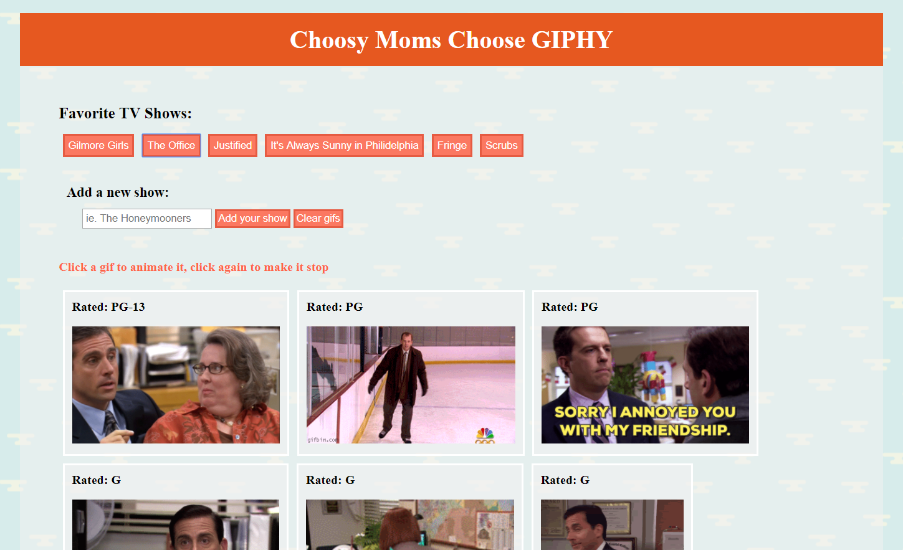

# GIHPY Gifs
Link to app: https://elspetha5.github.io/GIPHY/

Here I used the theme of my favorite TV shows to exhibit my knowledge about api's and ajax. You can click on any of the pre-made buttons to search for gifs from those shows, or you can create your own button in order to get 10 images back from the Giphy site. You then animate those images by clicking on them and still the image by clicking it again. The buttons you make don't have to be just TV shows, it can be anything you want to search Giphy for. Enjoy!